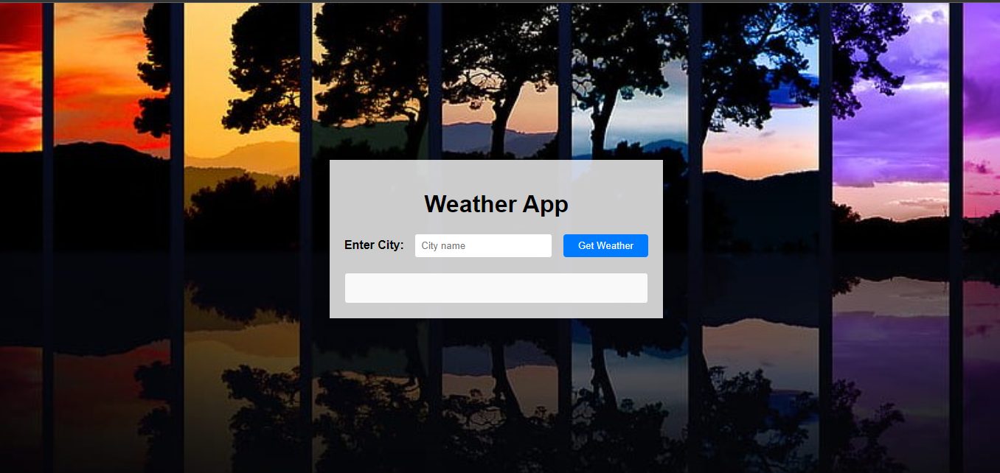

# Weather APP - monolìtica

Esta es una aplicación web básica que permite a los usuarios consultar la información del clima de una ciudad. La aplicación se implementa como una aplicación monolítica utilizando tecnologías como Node.js, Express, HTML, CSS y JavaScript. A continuación, se proporciona una descripción detallada del proyecto.

## Estructura del Proyecto

El proyecto está organizado de la siguiente manera:

- **weather-app**
    - *index.html*
    - *styles.css*
    - *index.js*
    - *app.js*
    
 Contiene archivos estáticos (HTML, CSS, JS) para el frontend.
- **app.js**: Archivo principal del servidor monolítico.


## Configuración e Instalación

1. **Instalación de Dependencias:**

   ```bash
   npm install
   ```

2. **Ejecución de la Aplicación:**

   ```bash
   1. (En consola) git clone https://github.com/samuelzapatam22/reto2.git
   2. npm start (en la consola de WeatherApp).
   ```

   La aplicación se ejecutará en [http://localhost:3000](http://localhost:3000).


   ## Funcionalidades

- **Formulario de Consulta de Clima:**

    


  - Endpoint `/weather` que muestra un formulario para que el usuario ingrese el nombre de una ciudad.
  - Al enviar el formulario, la aplicación llama al endpoint anterior para obtener la información del clima y la muestra en la página web.

- **Consulta de Clima por Ciudad:**

    


  - Endpoint `/api/weather/:city` que devuelve información del clima de la ciudad especificada en la ruta, incluyendo temperatura actual, humedad, presión atmosférica y velocidad del viento.


## Arquitecturas

- **Monolìtica:**

La elección de una arquitectura monolítica para Weather APP se debe a su **simplicidad y rapidez** en el desarrollo, facilitando el despliegue y la coordinación. Esto es especialmente beneficioso para peste pequeño proyecto con requisitos claros y tiempos de entrega rápidos. Aunque la escalabilidad puede ser limitada y el mantenimiento a largo plazo más desafiante, la arquitectura monolítica resulta **eficiente y fácil de depurar** para Weather APP.

- **Microservicios:**

1. **División :**
   - Crearía microservicios separados para las funcionalidades principales, como la consulta del clima y la gestión del formulario, para mejorar la modularidad.

2. **Endpoint Específico para Clima:**
   - Un microservicio dedicado gestionaría el endpoint `/api/weather/:city`, manejando la lógica de consulta y devolviendo datos climáticos reales utilizando la API de OpenWeatherMap.

3. **Microservicio de Frontend:**
   - Implementaría un microservicio independiente para manejar el formulario de consulta y la presentación de resultados, permitiendo una gestión flexible de la interfaz de usuario.

4. **Comunicación entre Microservicios:**
   - Establecería una comunicación eficiente entre los microservicios mediante HTTP o un protocolo de comunicación adecuado.


Con este README, tienes toda la información necesaria para entender la estructura y funcionamiento básico de Weather APP. Siéntete libre de contribuir o realizar mejoras al proyecto. ¡Disfruta explorando el clima de diferentes ciudades!

   
